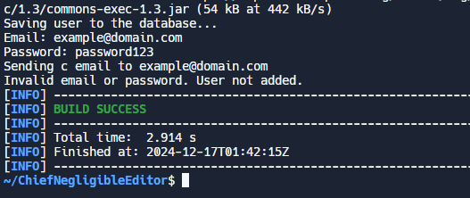
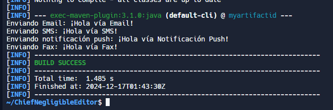
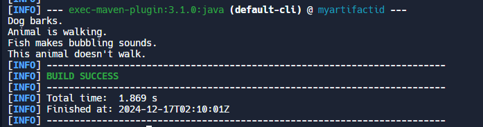
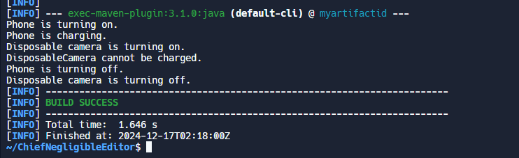
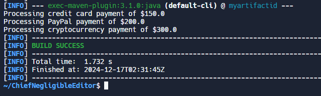

Integrantes: Gabriel Erazo, Angel Vela, Anthony Cochea, Erick Rosero

# Reflexión sobre el Principio SOLID - Single Responsibility Principle (SRP)

El **Single Responsibility Principle (SRP)** es uno de los principios fundamentales del diseño de software, parte de SOLID. Este principio establece que una clase debe tener una única razón para cambiar, es decir, debe estar enfocada en una sola responsabilidad o propósito. Aplicar SRP mejora la mantenibilidad, legibilidad y escalabilidad del código, ya que divide las responsabilidades entre diferentes clases.

En el contexto de las clases proporcionadas, SRP ha sido implementado de manera efectiva mediante la separación de las responsabilidades en diferentes componentes. A continuación, se detalla cómo se aplicó este principio y los beneficios obtenidos.

---

## Uso del SRP en las Clases

### 1. **Separación de Validación: Clase `Validator`**
La clase `Validator` está dedicada exclusivamente a la validación de correos electrónicos y contraseñas. Esta separación elimina la lógica de validación de `UserManager`, lo que simplifica la responsabilidad de esta última. Si se requiere cambiar las reglas de validación en el futuro, esto puede hacerse únicamente en la clase `Validator`.

**Responsabilidad de la clase:**
Validar entradas del usuario (correo electrónico y contraseña).

---

### 2. **Separación de Notificaciones: Clase `UserSendNotifications`**
La clase `UserSendNotifications` maneja exclusivamente el envío de correos electrónicos, aislando la responsabilidad de notificaciones. Esto garantiza que cualquier cambio en la lógica de notificación no afecte a la clase `UserManager`.

**Responsabilidad de la clase:**
Enviar notificaciones a los usuarios (por ejemplo, correos electrónicos de bienvenida).

---

### 3. **Gestión de Usuarios: Clase `UserManager`**
La clase `UserManager` ahora actúa como un orquestador que utiliza las funcionalidades de `Validator`, `DBManager` y `UserSendNotifications`. Su única responsabilidad es coordinar las operaciones relacionadas con los usuarios, como agregar nuevos usuarios al sistema.

**Responsabilidad de la clase:**
Gestionar el flujo de creación de usuarios asegurándose de que cada paso se delegue a la clase adecuada.

---

### 4. **Gestión de Datos: Clase `DBManager`**
Aunque no está incluida explícitamente en el código, se menciona en `UserManager` como el encargado de interactuar con la base de datos. Idealmente, su responsabilidad está confinada a almacenar y recuperar datos.

**Responsabilidad de la clase:**
Persistir y recuperar datos de los usuarios.

---

## Reflexiones
El Single Responsibility Principle (SRP) permite crear sistemas más organizados, modulares y fáciles de mantener al asignar a cada clase una única responsabilidad.

1. **Facilidad de Mantenimiento:**
   Cada clase está enfocada en un único propósito, lo que facilita su entendimiento y mantenimiento. Si una parte del sistema requiere cambios, estos se pueden realizar en la clase específica sin afectar a otras.

2. **Reusabilidad:**
   Las clases como `Validator` y `UserSendNotifications` pueden ser reutilizadas en otros contextos del sistema sin depender de `UserManager`.

3. **Testabilidad:**
   Con responsabilidades bien definidas, las clases son más fáciles de probar de manera aislada, lo que mejora la calidad del código y reduce los errores.

4. **Escalabilidad:**
   Si en el futuro se requieren nuevas funcionalidades (por ejemplo, validaciones adicionales o diferentes tipos de notificaciones), estas pueden ser integradas de manera modular sin afectar el diseño existente.

---

## Conclusión del primer principio realizado

El principio de responsabilidad única es esencial para desarrollar software robusto y escalable. En este ejemplo, las clases han sido divididas adecuadamente según sus responsabilidades, permitiendo un diseño limpio y modular. Aplicar SRP no solo mejora la calidad del código, sino que también facilita su evolución frente a cambios y nuevos requisitos, convirtiéndose en una piedra angular para el éxito a largo plazo de un proyecto.

---

# Reflexión sobre el Principio SOLID - Open/Closed Principle (OCP)

## Definición y Propósito del Principio

El Open/Closed Principle (OCP) establece que las entidades de software (clases, módulos, funciones) deben estar **abiertas para extensión** pero **cerradas para modificación**. Esto permite que se agreguen nuevas funcionalidades sin alterar el código existente, promoviendo flexibilidad y estabilidad en el diseño del sistema.

---

## Uso de las Clases Utilizadas

### `Notification` (Interfaz)
La interfaz `Notification` define el contrato que deben seguir todas las clases de notificación, garantizando que todas implementen el método `send`. Esta abstracción permite que el código cliente pueda trabajar con cualquier tipo de notificación sin conocer su implementación concreta.

### `EmailNotification`
La clase `EmailNotification` implementa la lógica específica para enviar notificaciones por correo electrónico. Esta clase encapsula toda la funcionalidad relacionada con el envío de correos, lo que hace que el código sea más modular y fácil de mantener.

### `SMSNotification`
La clase `SMSNotification` se encarga de enviar notificaciones por mensaje de texto. Al igual que `EmailNotification`, esta clase maneja todos los detalles específicos del envío de SMS, aislando dicha funcionalidad y permitiendo una mayor flexibilidad al agregar o modificar tipos de notificación.

### `PushNotification`
La clase `PushNotification` implementa el envío de notificaciones push a dispositivos móviles. Siguiendo el mismo patrón que las otras clases, permite agregar nuevas formas de notificación sin afectar el resto del sistema, manteniendo la cohesión y el bajo acoplamiento.

### `NotificationService`
La clase `NotificationService` orquesta el envío de notificaciones utilizando la interfaz `Notification`. A través de la inyección de dependencias, esta clase permite el uso de cualquier tipo de notificación, sin necesidad de modificaciones al código existente, promoviendo así la extensibilidad y el respeto al OCP.

---

## 4. Reflexión sobre el Principio OCP

Al aplicar el **Principio Open/Closed**, logramos:  
1. **Extensión sin modificación:**  
   Nuevas funcionalidades se agregan creando nuevas clases sin alterar el código existente.

2. **Mayor flexibilidad y escalabilidad:**  
   El sistema se vuelve más robusto y adaptable a cambios futuros.

3. **Reducción de errores:**  
   Al no modificar clases existentes, se reduce el riesgo de introducir fallos inesperados.

4. **Facilidad de mantenimiento:**  
   Cada clase tiene una única responsabilidad y puede ser extendida independientemente.

---

## Conclusión del segundo principio realizado

La refactorización del código según el principio OCP ha permitido crear un sistema más flexible y escalable, donde cada tipo de notificación se maneja de manera independiente. Este enfoque facilita la incorporación de nuevos tipos de notificación sin necesidad de modificar las clases existentes, mejorando la mantenibilidad y reduciendo el riesgo de introducir errores. La implementación de polimorfismo y la utilización de interfaces han simplificado el código y mejorado su estructura general.

---

# Reflexión sobre el Principio SOLID - Liskov Substitution Principle (LSP)

El **Liskov Substitution Principle (LSP)** es un principio fundamental dentro de SOLID que establece que los objetos de una clase derivada deben poder reemplazar a los objetos de su clase base sin alterar el comportamiento esperado del programa. Este principio promueve el polimorfismo y asegura que las subclases cumplan con las expectativas de los clientes que usan la clase base.

En el contexto de las clases proporcionadas, el LSP ha sido considerado parcialmente, pero se identificaron áreas de mejora para garantizar su correcta implementación. A continuación, se analiza su aplicación y se proponen mejoras.

---

## Uso del LSP en las Clases

### 1. **Abstracción Base: Clase `Animal`**
La clase abstracta `Animal` define el método `makeSound()`, que obliga a las subclases a implementar su propio comportamiento para producir un sonido. Esto permite que `Dog` y `Fish` sean tratadas de manera uniforme como instancias de `Animal`.

**Responsabilidad de la clase:**
Proveer una interfaz común para todas las subclases mediante el método abstracto `makeSound()`.

**Cumplimiento del LSP:**
Las subclases `Dog` y `Fish` respetan las expectativas del cliente sobre el método `makeSound()`, cumpliendo con el principio.

---

### 2. **Comportamiento Adicional: Interfaz `Walkable`**
La interfaz `Walkable` añade el método `walk()` para los animales que pueden caminar. Esto separa claramente los animales que pueden caminar de aquellos que no, evitando la inclusión de métodos innecesarios en la clase base.

**Responsabilidad de la interfaz:**
Definir el comportamiento de caminar exclusivamente para las clases que lo soporten.

**Problema con el LSP:**
En el cliente (`Main`), se utiliza `instanceof` para verificar si un objeto es `Walkable`, lo cual rompe el principio LSP. El cliente no debería necesitar conocer detalles específicos de las subclases ni realizar verificaciones explícitas.

---

### 3. **Cliente: Clase `Main`**
El cliente intenta interactuar con `Animal` de manera genérica, pero utiliza verificaciones de tipo y casting para manejar animales que implementan `Walkable`. Esto introduce un comportamiento condicional que contradice el LSP.

**Problema:**
El cliente no puede sustituir libremente instancias de `Animal` sin modificar su lógica interna, lo cual indica una violación al principio.

---
## Reflexiones

1. **Cumplimiento del Polimorfismo:**
   Las subclases pueden ser utilizadas como instancias de la clase base sin necesidad de manejar condiciones específicas en el cliente.

2. **Eliminación de Verificaciones de Tipo:**
   Evitar el uso de `instanceof` reduce el acoplamiento entre clases, facilitando la mantenibilidad y extensibilidad del sistema.

3. **Flexibilidad y Extensibilidad:**
   Nuevas subclases de `Animal` pueden ser integradas sin modificar la lógica del cliente.

---

## Conclusion del tercer principio realizado

Tenemos que tener cuidado con las clases padre ya que si la clase padre tiene mas requisitos de los que se debe puede perjudicar en el desarollo.Aplicar este principio de manera correcta no solo mejora la calidad del diseño, sino que también facilita la evolución y escalabilidad del sistema frente a nuevos requisitos. En este ejemplo, el rediseño propuesto permite cumplir plenamente con el LSP, mejorando la cohesión y reduciendo el acoplamiento en el código.

---

# Interface Segregation Principle (ISP)

### Definición
El principio de segregación de interfaces establece que "una clase no debe ser forzada a implementar interfaces que no utiliza". Esto significa que las interfaces deben ser diseñadas para ser específicas, asegurando que las clases que las implementan solo dependan de los métodos que realmente necesitan.

---

## Uso de las Clases

### `Device` (Interfaz inicial)
Define un conjunto de métodos generales (`turnOn`, `turnOff`, `charge`) aplicables a dispositivos electrónicos. Sin embargo, esta interfaz es demasiado amplia y obliga a implementar métodos que algunos dispositivos no necesitan, como el método `charge` para dispositivos desechables.

### `Phone`
Representa un dispositivo recargable como un teléfono móvil. Esta clase implementa los métodos necesarios para encender, apagar y cargar el dispositivo, reflejando correctamente su funcionalidad.

### `DisposableCamera`
Representa un dispositivo no recargable como una cámara desechable. Esta clase debe implementar el método `charge` aunque no lo utilice, lo que genera una excepción y rompe la lógica de diseño.

### Refactorización: Interfaz Segregada
Después de aplicar el ISP, se crearon interfaces más específicas como `Powerable` (para encender/apagar dispositivos) y `Rechargeable` (para dispositivos recargables). Estas interfaces segregadas permiten que cada clase implemente únicamente los métodos que realmente necesita, eliminando dependencias innecesarias y mejorando la coherencia del diseño.

---

## Reflexiones

1. **Dependencia de métodos innecesarios**: Las clases se ven obligadas a implementar métodos que no son relevantes para su funcionalidad, generando código innecesario o incoherente.
2. **Modificaciones frecuentes en interfaces generales**: Cuando se actualiza una interfaz grande, todas las clases que la implementan pueden verse afectadas, incluso si no utilizan los métodos modificados.
3. **Acoplamiento excesivo**: Interfaces demasiado generales pueden crear dependencias no deseadas, lo que dificulta la extensión o adaptación del sistema a nuevos requerimientos.

---

## Conclusión
La aplicación del principio de segregación de interfaces (ISP) ayuda a crear un diseño más modular y flexible al dividir interfaces generales en interfaces específicas. Esto garantiza que las clases solo implementen los métodos que realmente necesitan, mejorando la mantenibilidad y reduciendo errores relacionados con la implementación de métodos innecesarios. En este caso, la segregación de la interfaz `Device` permitió que cada dispositivo reflejara sus capacidades reales sin generar excepciones ni lógica innecesaria. Esta práctica es esencial para construir sistemas escalables y adaptables.

---

# Dependency Inversion Principle (DIP)
- Los módulos de alto nivel no deben depender de módulos de bajo nivel. Ambos deben depender de abstracciones.  
- Las abstracciones no deben depender de detalles; los detalles deben depender de abstracciones.

---

## Uso de las Clases

1. **CreditCardPayment**:  
   Representa un método de pago específico que procesa pagos con tarjeta de crédito. Proporciona la funcionalidad para realizar la transacción, pero no está diseñada para permitir otros métodos de pago.

2. **PaymentProcessor**:  
   Es responsable de gestionar los pagos. Sin embargo, depende directamente de `CreditCardPayment`, lo que limita su flexibilidad y hace imposible la inclusión de otros métodos de pago sin modificar su código.

### Código Refactorizado:

1. **Interfaz PaymentMethod**:  
   Define un contrato genérico para todos los métodos de pago. Todas las implementaciones específicas de pago deben adherirse a esta interfaz.

2. **CreditCardPayment (Implementación de PaymentMethod)**:  
   Implementa el contrato de `PaymentMethod` para procesar pagos mediante tarjeta de crédito.

3. **PayPalPayment (Implementación de PaymentMethod)**:  
   Proporciona una implementación para procesar pagos a través de PayPal.

4. **CryptoPayment (Implementación de PaymentMethod)**:  
   Define la funcionalidad para procesar pagos con criptomonedas, mostrando la flexibilidad de incorporar nuevos métodos sin afectar otros módulos.

5. **PaymentProcessor**:  
   Ahora depende de la abstracción `PaymentMethod`. Puede procesar cualquier tipo de pago, siempre que se le proporcione una implementación de la interfaz, eliminando la dependencia directa de detalles específicos.

---

## Reflexiones

1. **Dependencia de Clases Concretas**:  
   Los módulos de alto nivel dependen directamente de implementaciones específicas de bajo nivel, lo que dificulta las modificaciones y pruebas del sistema.

2. **Dificultad para Cambiar o Ampliar Funcionalidades**:  
   Introducir nuevos comportamientos (como un nuevo método de pago o notificación) implica cambios en los módulos existentes, lo que aumenta el riesgo de errores.

3. **Falta de Flexibilidad**:  
   La dependencia de detalles concretos hace que el sistema sea rígido, reduciendo la posibilidad de reutilizar o sustituir componentes fácilmente.

---

## Conclusiones

El **Dependency Inversion Principle (DIP)** es crucial para el diseño de sistemas robustos y sostenibles. En el caso presentado, la refactorización permitió:  

- **Reducir el acoplamiento** entre `PaymentProcessor` y los métodos de pago específicos.  
- **Aumentar la flexibilidad**, permitiendo agregar nuevos métodos de pago sin modificar las clases existentes.  
- **Facilitar las pruebas unitarias**, al permitir el uso de implementaciones simuladas para validar el comportamiento de `PaymentProcessor`.

---